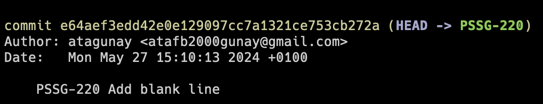

# gc2

## Overview
This repository contains a simple Go script that automatically appends the current Git branch name to commit messages.



## Features
- Automatically fetches the current branch name.
- Appends the branch name to commit messages for better tracking.

## Installation
1. Clone the repository:
    ```bash
    git clone https://github.com/atagunay/gitCommitWithBranchName.git
    ```
2. Navigate to the project directory:
    ```bash
    cd gitCommitWithBranchName
    ```

## Usage

You can compile the code with a arbitrary name or you can use the executable file in the project directory directly.

1. Compile the script:
    
You can use whatever you want as the output file name. In this example, the output file name is `gc`. You will use the program with that name.


```bash
go build -o gc main.go
```

2. Move the executable file to a directory in your PATH:

You can learn the directory of the project with the following command: `pwd` 

```bash
sudo mv $PATH_OF_THE_EXECUTABLE_FILE /usr/local/bin/
```

3. Call it in a project where you have already initialized a Git repository:

**Note:** First of all, you shuld use `git add` command to add the files to the staging area.

```bash
gc -m "Your commit message"
``` 

The script will append the current branch name to the commit message.

## Contributing
Feel free to fork the repository and submit pull requests. For major changes, please open an issue first to discuss what you would like to change.

## License
This project is licensed under the MIT License.

For more details, visit the [repository](https://github.com/atagunay/gitCommitWithBranchName).
